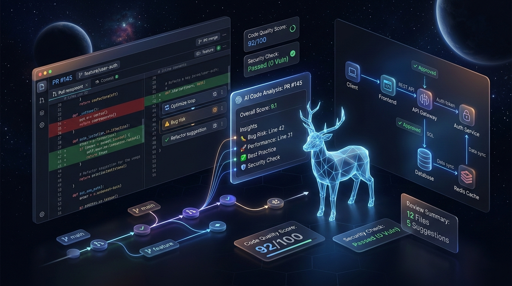

<h1 align="center">DebugDeer 🦌</h1>

<p align="center">
  An AI-powered code review and debugging assistant that analyzes pull requests, detects issues, and helps developers ship cleaner, more reliable code faster.
</p>

<div align="center">
  
</div>

## 🔋 Features

- 🧠 **AI-powered code reviews** for pull requests and commits
- 🐞 **Automatic bug detection** with actionable suggestions
- 🔍 **Code quality analysis** covering best practices and anti-patterns
- 🔐 **Secure authentication** with GitHub OAuth integration
- ⚙️ **Repository-level insights** with contextual feedback
- 🤖 **Developer-friendly comments** directly on PRs
- ⚡ **Fast and scalable architecture** for real-time analysis
- 🧩 **Language-agnostic design** with an extensible rule engine

## ⚙️ Tech Stack

- 🧠 **AI Engine:** Gemini
- 🌐 **Frontend:** React, TypeScript, Tailwind CSS, shadcn/ui
- 🛠 **Backend:** Express.js, TypeScript, Bun
- 🔐 **Authentication:** Better Auth
- 🔄 **Integrations:** GitHub Webhooks, REST APIs, Octokit
- 📦 **Database:** PostgreSQL, Drizzle ORM
- ⚡ **Background Jobs:** Inngest
- 🧠 **Vector Database:** Pinecone

<!--
## 🤸 Installation

### 1. Clone the Repository

```bash
git clone https://github.com/soumadip-dev/DebugDeer.git
cd DebugDeer
```

### 2. Backend Setup

```bash
cd server
bun install
```

Create a `.env` file in the `server` directory:

```env
PORT=3000
DATABASE_URL=<YOUR_DATABASE_URL>
GITHUB_CLIENT_ID=<YOUR_GITHUB_CLIENT_ID>
GITHUB_CLIENT_SECRET=<YOUR_GITHUB_CLIENT_SECRET>
WEBHOOK_SECRET=<YOUR_GITHUB_WEBHOOK_SECRET>
AI_API_KEY=<YOUR_AI_API_KEY>
```

### 3. Setup Database (Drizzle)

Generate database migrations:

```bash
bunx drizzle-kit generate
```

Apply migrations to your PostgreSQL database:

```bash
bunx drizzle-kit migrate
```

Alternatively, during development you can directly push the schema:

```bash
bunx drizzle-kit push
```

### 4. Frontend Setup

```bash
cd ../client
bun install
```

Create a `.env` file in the `client` directory:

```env
NEXT_PUBLIC_GITHUB_CLIENT_ID=<YOUR_GITHUB_CLIENT_ID>
NEXT_PUBLIC_API_URL=http://localhost:3000/api
```

### 5. Run the Application

Backend:

```bash
cd server
bun run dev
```

Frontend:

```bash
cd client
bun run dev
```
 -->
